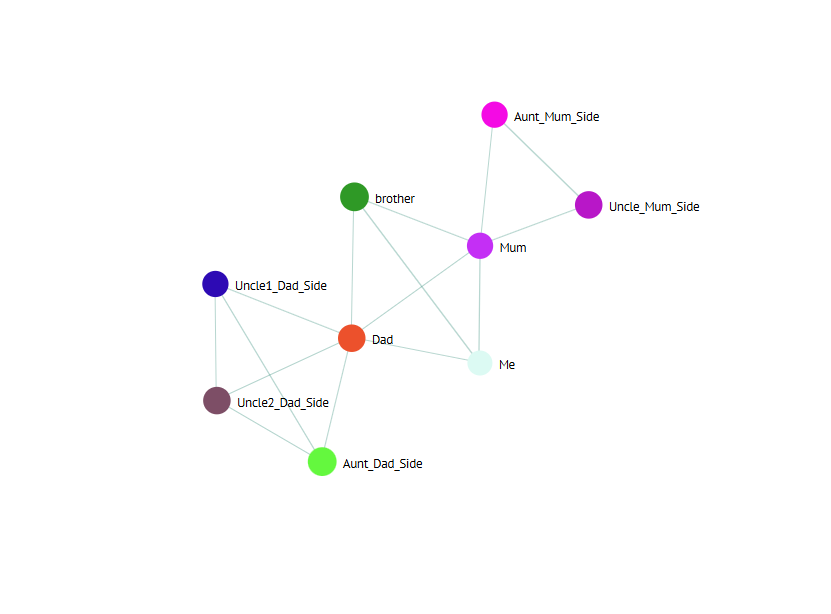

# Family tree project

I changed the node to show two generations of family excluding cousins, so each node represents a family member and is connected to their immediate coonection.

To get started, you need to ensure that you have NPM and Node running on your machine. Install the dependencies (npm install) and then run the project locally (npm run serve):

## Project setup
```
npm install
```

### Compiles and hot-reloads for development
```
npm run serve
```

### Compiles and minifies for production
```
npm run build
```

### Lints and fixes files
```
npm run lint
```

### Customize configuration
See [Configuration Reference](https://cli.vuejs.org/config/).


